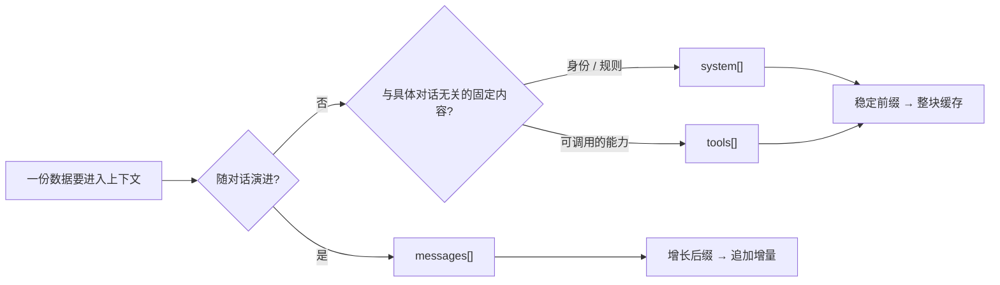
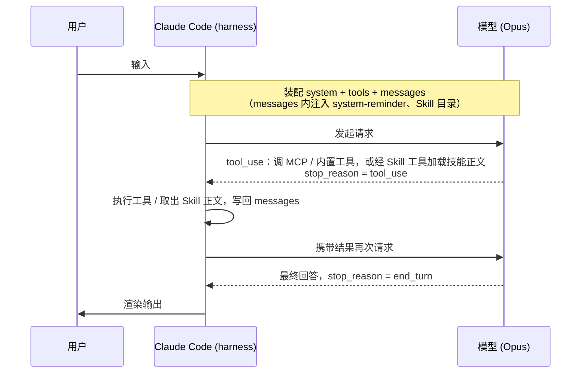
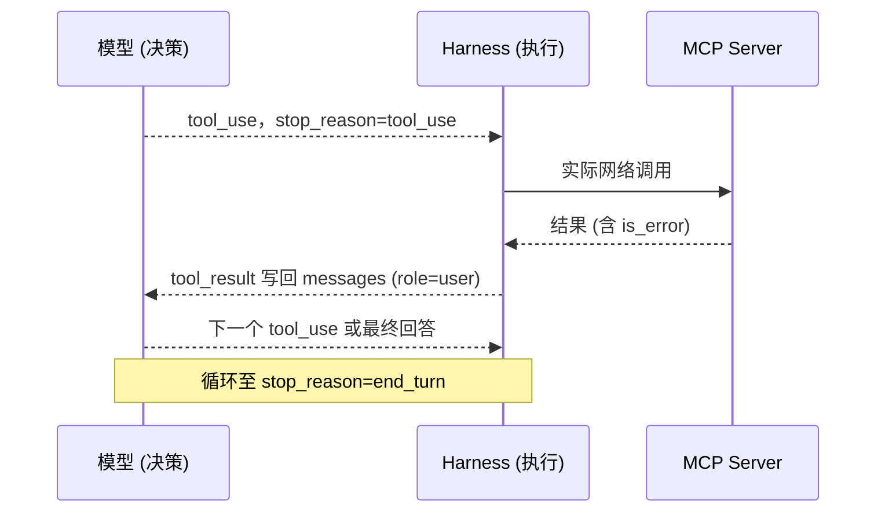

# Claude Code的上下文装配


> 用两次抓包，拆开 Claude Code 与 Opus 之间一次请求的全部结构：`system` / `tools` / `messages` 各自的职责与内部形态，以及 `system-reminder`、Skill、MCP、Memory 这些机制分别落在结构的哪一层、何时触发。

## 抓包样本

经由 `Claude Tap` 截获客户端（`claude-cli/2.1.173`）与上游 `api.anthropic.com` 之间的明文流量，取两条记录：

| 样本 | turn | 场景 | 用途 |
| --- | --- | --- | --- |
| A | 2 | 用户发出「你好」，模型返回问候 | 最小化的首轮请求，结构最干净 |
| B | 5 | `你好` → `集群巡检` → MCP 调用返回鉴权失败 → 模型再次发起调用 | 含完整工具往返与缓存命中 |
| C | 7 | 用户输入 `/gitlab`，加载 Skill 正文后模型发起首个动作 | Skill 正文如何按需注入（片段见 Skill 一节） |

下面是两段抓包的精简形态（去掉了鉴权 token、重复的 `X-Stainless-*` 头与 `tools` 数组全文，只留能体现结构的字段）。后文各节都是在拆解它：

:::: details 点击展开两段抓包原文（精简）
::: code-group
```jsonc [样本 A · turn 2（首轮）]
{
  "turn": 2,
  "request": {
    "path": "/v1/messages?beta=true",
    "headers": {
      "User-Agent": "claude-cli/2.1.173 (external, cli)",
      "X-Claude-Code-Session-Id": "6769489a-b7a2-...",
      "anthropic-beta": "claude-code-20250219,mid-conversation-system-2026-04-07,extended-cache-ttl-2025-04-11,context-management-2025-06-27,redact-thinking-2026-02-12,effort-2025-11-24,..."
    },
    "body": {
      "model": "claude-opus-4-8",
      "system": [
        { "type": "text", "text": "x-anthropic-billing-header: cc_version=2.1.173.53a; ..." },
        { "type": "text", "text": "You are Claude Code, ...",
          "cache_control": { "type": "ephemeral", "ttl": "1h" } },
        { "type": "text", "text": "...# Harness ...# Memory ...# Environment ...# Language ...",
          "cache_control": { "type": "ephemeral", "ttl": "1h" } }
      ],
      "messages": [
        { "role": "user", "content": [
          { "type": "text", "text": "<system-reminder> ...CLAUDE.md / MEMORY.md / currentDate... </system-reminder>" },
          { "type": "text", "text": "你好", "cache_control": { "type": "ephemeral", "ttl": "1h" } }
        ] },
        { "role": "system", "content": "The following skills are available...\n- gitlab: ...\n- claude-api: ..." }
      ],
      "tools": [
        {
          "name": "mcp__boc-mcp__boc_cluster_list",
          "description": "列出 BOC 容器平台当前账户可见的所有 Kubernetes 集群...",
          "input_schema": { "type": "object", "properties": {}, "required": [] }
        }
        /* …及其余内置工具（Bash/Read/Edit…）与 MCP 工具（mcp__chrome-devtools__*） */
      ],
      "max_tokens": 64000,
      "thinking": { "type": "adaptive" },
      "context_management": { "edits": [ { "type": "clear_thinking_20251015", "keep": "all" } ] },
      "output_config": { "effort": "high" },
      "stream": true
    }
  },
  "response": {
    "status": 200,
    "body": {
      "content": [ { "type": "text", "text": "你好！...（问候语）" } ],
      "stop_reason": "end_turn",
      "usage": { "cache_creation_input_tokens": 60008, "cache_read_input_tokens": 0, "output_tokens": 309 }
    }
  }
}
```

```jsonc [样本 B · turn 5（含工具往返）]
{
  "turn": 5,
  "request": {
    "path": "/v1/messages?beta=true",
    "body": {
      "model": "claude-opus-4-8",
      "system": [ /* 同 A：billing 头 + 人设主体，后两块打 1h 缓存 */ ],
      "messages": [
        { "role": "user",      "content": [ /* <system-reminder> + "你好" */ ] },          // [0]
        { "role": "system",    "content": "The following skills are available..." },        // [1] Skill 目录
        { "role": "assistant", "content": [ { "type": "text", "text": "你好！..." } ] },     // [2]
        { "role": "user",      "content": "集群巡检" },                                      // [3]
        { "role": "assistant", "content": [                                                 // [4]
          { "type": "thinking", "thinking": "", "signature": "EoUDCmMI..." },
          { "type": "text", "text": "我来帮你做集群巡检。先看看平台上有哪些集群。" },
          { "type": "tool_use", "id": "toolu_01Qi6q...",
            "name": "mcp__boc-mcp__boc_cluster_list", "input": {} }
        ] },
        { "role": "user", "content": [                                                      // [5]
          { "type": "tool_result", "tool_use_id": "toolu_01Qi6q...",
            "content": "token 无效或已过期", "is_error": true,
            "cache_control": { "type": "ephemeral", "ttl": "1h" } }
        ] }
      ],
      "tools": [ /* 同 A */ ],
      "context_management": { "edits": [ { "type": "clear_thinking_20251015", "keep": "all" } ] },
      "output_config": { "effort": "high" }
    }
  },
  "response": {
    "status": 200,
    "body": {
      "content": [
        { "type": "thinking", "thinking": "", "signature": "" },
        { "type": "tool_use", "id": "toolu_01B7oa...",
          "name": "mcp__boc-mcp__boc_license_info", "input": {} }
      ],
      "stop_reason": "tool_use",
      "usage": { "cache_creation_input_tokens": 159, "cache_read_input_tokens": 62462, "output_tokens": 91 }
    }
  }
}
```

```jsonc [样本 C · turn 7（Skill 正文加载）]
{
  "turn": 7,
  "request": {
    "path": "/v1/messages?beta=true",
    "body": {
      "model": "claude-opus-4-8",
      "system": [ /* 同 A */ ],
      "messages": [
        /* ...前几轮：hello / 集群巡检 / token 失效... */
        { "role": "user", "content": [                                          // 用户输入 /gitlab
          { "type": "text",
            "text": "<command-message>gitlab</command-message>\n<command-name>/gitlab</command-name>" },
          { "type": "text",
            "text": "Base directory for this skill: ...\\skills\\gitlab\n\n## 角色定义 ...（完整 SKILL.md 正文）...",
            "cache_control": { "type": "ephemeral", "ttl": "1h" } }   // 正文打 1h 缓存
        ] }
      ],
      "tools": [ /* 同 A */ ]
    }
  },
  "response": {
    "status": 200,
    "body": {
      "content": [
        { "type": "text", "text": "GitLab 技能已加载。先确认 gitbeaker 是否安装..." },
        { "type": "tool_use", "name": "Bash",
          "input": { "command": "gitbeaker --version ...", "description": "检查 gitbeaker 安装与认证环境变量" } }
      ],
      "stop_reason": "tool_use",
      "usage": { "cache_creation_input_tokens": 5555, "cache_read_input_tokens": 62442, "output_tokens": 682 }
    }
  }
}
```
:::
::::

## 标准交互结构

### 请求的组成与职责

底层模型是无状态的，不持有任何跨请求记忆。一次推理在数学上等价于：

$$
\text{output} = f(\text{system},\ \text{tools},\ \text{messages})
$$

每次请求都要把模型"需要知道的一切"完整重放一遍。请求体顶层是个扁平对象，承载上下文的是三个数组，外加若干控制字段：

```jsonc
{
  "model": "claude-opus-4-8",
  "system":   [ /* 系统提示词：模型是谁、守什么规矩 */ ],   // [!code highlight]
  "tools":    [ /* 工具定义：模型能调用什么 */ ],           // [!code highlight]
  "messages": [ /* 对话序列：聊到哪了、发生过什么 */ ],      // [!code highlight]
  "max_tokens": 64000,
  "thinking": { "type": "adaptive" },
  "context_management": { "edits": [ /* 历史 thinking 回收策略 */ ] },
  "output_config": { "effort": "high" },
  "stream": true
}
```

三者职责分明，数据各就其位：

| 数组 | 职责 | 典型内容 | 跨轮变化 |
| --- | --- | --- | --- |
| `system` | 模型的身份与硬约束 | 角色定义、行为准则、环境信息、输出语言 | 全程稳定 |
| `tools` | 模型可调用的能力面 | 内置工具与 MCP 工具的名称、描述、入参 schema | 全程稳定 |
| `messages` | 随对话演进的事件序列 | 用户输入、模型输出、工具往返、带外注入 | 每轮追加 |

一份数据该放哪一层，只看两点：是否随对话演进、是否需被模型感知为"对话的一部分"。



### 一轮交互的整体时序

把一次"用户提问 → 工具调用 → 最终回答"摊开，Claude Code（harness）与模型之间是多次往返：



每一次 `H->>M`，harness 都会重新装配一遍完整上下文。Skill 在这里出现两次：装配时它的**目录**先被注入 `messages`，等到真正要用（用户敲 `/skill` 或模型自己判断需要）时，**正文**才被加载进来——这两步分别在 Skill 一节展开。后文各种注入，都发生在这个装配环节。

## 三个数组的内部结构

### system：分块的系统提示词

`system` 是一个**分块数组**，每块是 `{type, text}`，可单独挂缓存标记：

```jsonc [system · 分块与缓存断点]
"system": [
  { "type": "text",
    "text": "x-anthropic-billing-header: cc_version=2.1.173.53a; ..." },     // 易变，不缓存

  { "type": "text",
    "text": "You are Claude Code, Anthropic's official CLI for Claude.",
    "cache_control": { "type": "ephemeral", "ttl": "1h" } },                  // [!code highlight] 缓存断点 1

  { "type": "text",
    "text": "...# Harness ...# Memory ...# Environment ...# Language ...",
    "cache_control": { "type": "ephemeral", "ttl": "1h" } }                   // [!code highlight] 缓存断点 2
]
```

第三块是主体，包含 Claude Code 的全部出厂设定：行为约束、Memory 机制（见后文 Memory 一节）、Environment（工作目录、操作系统、`claude-opus-4-8[1m]` 模型标识）、强制中文回复等。这块内容每轮都一样，很适合缓存。

这里的缓存指**前缀缓存**：把请求开头那段稳定不变的内容在服务端存一份，下次请求只要这段前缀没变，就直接复用、不再重新计算和计费。`system` 之所以要分块，就是为了把"每次都变"和"每次不变"的内容分开——计费头放最前面且不缓存，后面稳定的人设打上 `ttl: 1h` 的缓存标记。

效果直接体现在响应的 `usage` 里。先看懂三个字段：

- `cache_read_input_tokens`：命中缓存、直接复用的 token，几乎不花钱；
- `cache_creation_input_tokens`：首次写入缓存的 token，要付一次建缓存的成本；
- `input_tokens`：既没命中也没建缓存、真正重新计算的 token。

对比首轮（冷）与后续（热）：

::: code-group
```jsonc [样本 A · 首轮（冷启动）]
"usage": {
  "cache_creation_input_tokens": 60008,   // 首轮把 6 万 token 的人设 + 工具定义写进缓存
  "cache_read_input_tokens": 0            // 还没有可命中的前缀
}
```
```jsonc [样本 B · 后续轮（命中缓存）]
"usage": {
  "input_tokens": 2,                      // 真正新算的，几乎为 0
  "cache_creation_input_tokens": 159,     // 本轮新增内容写入缓存
  "cache_read_input_tokens": 62462        // 6.2 万 token 命中缓存，直接复用
}
```
:::

也就是：首轮花一次钱把 6 万 token 的人设和工具定义写进缓存，之后每轮这部分都走缓存、几乎不再计费。这就是把不变的东西放进 `system` / `tools` 的好处。

### tools：能力声明

`tools` 是工具定义数组，每个元素是 `{name, description, input_schema}`。`input_schema` 是标准 JSON Schema，模型据此知道每个工具收什么参数：

```jsonc [tools · 单个工具定义]
{
  "name": "mcp__boc-mcp__boc_cluster_list",
  "description": "列出 BOC 容器平台当前账户可见的所有 Kubernetes 集群...",
  "input_schema": { "type": "object", "properties": {}, "required": [] }
}
```

内置工具（`Bash` / `Read` / `Edit` / `Skill` …）与 MCP 工具混在同一个数组里。MCP 工具靠 `mcp__<server>__<tool>` 的命名前缀区分来源（详见 MCP 一节）。

### messages：带角色的事件序列

`messages` 是有序的 `(role, content)` 序列。`content` 可以是纯字符串，也可以是 **block 数组**（一条消息能同时含多种 block）：

| block 类型 | 出现在 | 含义 |
| --- | --- | --- |
| `text` | user / assistant | 普通文本 |
| `thinking` | assistant | 模型的思考过程（历史中会被清空脱敏） |
| `tool_use` | assistant | 模型发起的工具调用 |
| `tool_result` | user | 工具执行结果 |

`role` 标注每条消息的**来源**，是模型区分"谁在说话"的唯一依据：

| role | 来源 | 含义 |
| --- | --- | --- |
| `user` | 模型外部 | 喂给模型的输入。人类输入与工具结果**都属此类** |
| `assistant` | 模型自身 | 模型的产出：text / thinking / tool_use |
| `system` | 运行时（harness） | 带外注入的指令 |

记住这条判据，后面所有注入都能归位：

> `assistant` 是模型产出的；`user` 是喂给模型的（含工具结果）；`system` 是运行时插入的。

## system-reminder：会话级上下文的注入

`system-reminder` 不是顶层字段，而是被拼进**第一条 `user` 消息**的 content 数组（注入块在前，用户原文在后）：

```jsonc [messages[0] · 首条 user 消息]
{
  "role": "user",
  "content": [
    { "type": "text",
      "text": "<system-reminder> ... CLAUDE.md / 记忆索引 / 身份 / 日期 ... </system-reminder>" },  // [!code highlight]
    { "type": "text", "text": "你好" }   // content[1] 才是用户真正的输入
  ]
}
```

它承载的是**会话级上下文**：用户全局 `CLAUDE.md`、规则文件、持久化记忆索引（`MEMORY.md`，见 Memory 一节）、用户身份、当前日期。

::: details 展开 system-reminder 的实际内容（节选）
```text
<system-reminder>
As you answer the user's questions, you can use the following context:
# claudeMd
Contents of .../CLAUDE.md (user's private global instructions):
  ## 1. Think Before Coding ... ## 2. Simplicity First ...
# MEMORY.md
- push-only-when-asked — 别自动 push，commit 后等指令
- terse-comments — 注释要短、少、像人写的
# userEmail ...
# currentDate  Today's date is 2026/06/11.

IMPORTANT: this context may or may not be relevant... You should not
respond to this context unless it is highly relevant to your task.
</system-reminder>
```
:::

这也解释了一个现象：模型读到整份 `CLAUDE.md` 却不会主动复述——因为 reminder 末尾明确说了"跟当前任务无关就别理它"。

为什么挂在 `user` 消息而非顶层 `system`？因为它属于这次会话（带着用户的 `CLAUDE.md`、记忆），会跟着对话一起变；而 `system` 的人设是写死的、每次都一样。两类东西变化节奏不同，所以分开放。

## Skill：目录注入与正文加载

### Skill 的注入点

Skill 目录既不在顶层 `system`，也不在 `user` 消息内，而是 `messages` 中一条独立的 `role: "system"` 消息，紧随首条 `user`（`messages[1]`）：

```jsonc [messages · Skill 注入在 [1] 位]
[
  { "role": "user",   "content": [ /* system-reminder + 你好 */ ] },     // [0]
  { "role": "system",                                                     // [!code highlight] [1] Skill 目录
    "content": "The following skills are available...\n- gitlab: ...\n- deep-research: ...\n- claude-api: ... TRIGGER — read BEFORE ..." },
  { "role": "assistant", "content": [ /* 问候语 */ ] },                  // [2]
  { "role": "user",      "content": "集群巡检" }                         // [3]
]
```

按 Messages API 的标准规则，`messages` 里只能放 `user` 和 `assistant` 两种角色、交替出现，`system`（系统提示）只能待在请求顶层那个单独的 `system` 字段里。把它做成一条消息塞进 `messages` 中间是破例——这要靠请求头 `anthropic-beta` 里开的一个特性开关 `mid-conversation-system-2026-04-07`（字面就是"会话中途的 system 消息"）才被允许。

### Skill 的调用时机

注入到目录里的只是**名称加一句话描述**，完整说明书（`SKILL.md`）不在初始上下文里。正文在真正要用时才加载，有两条触发路径：

- **用户主动触发**：用户输入 `/gitlab` 这样的斜杠命令，harness 直接把对应 `SKILL.md` 正文作为一条 `user` 消息追加进 `messages`；
- **模型自主触发**：模型读目录后判断需要某 Skill，发起 `Skill` 工具调用，往返形式与 MCP 一致（见 MCP 一节）。部分目录项自带触发判据，例如 `claude-api` 写有 `TRIGGER` / `SKIP` 规则，把"何时该调用我"直接编码进描述。

样本 C（turn 7）是第一条路径的实证。用户输入 `/gitlab` 后，请求 `messages` 末尾多出这样一条消息，下一轮响应里模型已按技能内容开始行动：

::: code-group
```jsonc [① 用户 /gitlab 触发 · 正文作为 user 消息注入]
{
  "role": "user",
  "content": [
    { "type": "text",
      "text": "<command-message>gitlab</command-message>\n<command-name>/gitlab</command-name>" },  // [!code highlight] 斜杠命令标记
    { "type": "text",
      "text": "Base directory for this skill: ...\\skills\\gitlab\n\n## 角色定义\n...（完整 SKILL.md 正文）...",
      "cache_control": { "type": "ephemeral", "ttl": "1h" } }                                       // [!code highlight] 正文打 1h 缓存
  ]
}
```

```jsonc [② 模型读到正文后按技能行动 · response]
{
  "content": [
    { "type": "text", "text": "GitLab 技能已加载。先确认 gitbeaker 是否安装..." },
    { "type": "tool_use", "name": "Bash",
      "input": { "command": "gitbeaker --version ...", "...": "..." } }   // [!code highlight] 按技能要求先查环境
  ],
  "stop_reason": "tool_use"
}
```
:::

两个细节值得注意：`command-message` / `command-name` 标签标明这是斜杠命令触发，紧跟的第二个 text block 才是完整 `SKILL.md` 正文；正文往往很长，所以单独打了 1h 缓存，避免每轮重算。模型读到正文后即照技能指示行动——`gitlab` 技能要求"用任何命令前先确认 gitbeaker 已安装"，于是模型第一步就发起了 `gitbeaker --version` 的 Bash 调用。

## MCP：工具声明与调用

### MCP 的注入点

各 MCP server 暴露的工具以 `mcp__<server>__<tool>` 命名混入 `tools[]`，双下划线分隔 server 域与工具名：

```jsonc
{ "name": "mcp__boc-mcp__boc_cluster_list", "...": "..." },        // server=boc-mcp
{ "name": "mcp__chrome-devtools__navigate_page", "...": "..." }    // server=chrome-devtools
```

这一层只是声明"有哪些工具、怎么调"，不触发执行。

### MCP 的调用时机

实际调用是一对 `tool_use` ↔ `tool_result`，通过 id 对齐：

::: code-group
```jsonc [① assistant 发起]
{
  "role": "assistant",
  "content": [
    { "type": "text", "text": "先看看有哪些集群。" },
    { "type": "tool_use",
      "id": "toolu_01Qi6q...",                    // [!code highlight]
      "name": "mcp__boc-mcp__boc_cluster_list",
      "input": {} }
  ]
}
```

```jsonc [② 工具回包]
{
  "role": "user",                                 // [!code highlight] 回包仍是 user
  "content": [
    { "type": "tool_result",
      "tool_use_id": "toolu_01Qi6q...",           // [!code highlight] 以 id 对齐
      "content": "token 无效或已过期",
      "is_error": true }
  ]
}
```

```jsonc [③ 模型据结果续推]
{
  "content": [
    { "type": "tool_use", "id": "toolu_01B7oa...",
      "name": "mcp__boc-mcp__boc_license_info" }   // [!code highlight] 下一轮调用
  ],
  "stop_reason": "tool_use"                         // 让出控制权
}
```
:::

调用时机由模型自主决定，触发后让出控制权，harness 执行再回填：



::: tip 决策与执行分离
模型只决定"调什么"，真正的网络请求由 harness 在外层完成后回填结果。Skill、MCP、内置工具都走这一套统一的 `tool_use`/`tool_result` 循环。
:::

## Memory：作用与实现原理

Memory 让 Claude Code 跨会话记住事实（用户偏好、项目约束等）。它的实现完全是**文件型**的，抓包能从两端印证。

**机制是怎么写的**：`system` 提示词里说明了——每条记忆是一个独立文件，带 `name` / `description` / `metadata.type`（`user` / `feedback` / `project` / `reference`）的 frontmatter；写入后在 `MEMORY.md` 追加一行索引；`MEMORY.md` 是每个 session 都会加载进上下文的目录。

**实际注入的样子**：`MEMORY.md` 的内容确实出现在了 `system-reminder` 里（见 system-reminder 一节）：

```text
# MEMORY.md
- push-only-when-asked — 别自动 push，commit 后等指令
- terse-comments — 注释要短、少、像人写的
```

把两端拼起来，实现原理就清楚了：


::: info 索引 / 正文分离，与 Skill 同构
常驻上下文的只是 `MEMORY.md` 一行行的"标题 + 钩子"，单条记忆的正文留在各自文件里、按需读取。这与 Skill"目录常驻、正文按需"是同一种渐进式加载思路。
:::

## 小结

| 索引 | role | 内容 | 来源 |
| --- | --- | --- | --- |
| `[0]` | user | `system-reminder`（CLAUDE.md / Memory 索引 / 日期）+ 用户原文 | harness 拼接 |
| `[1]` | system | Skill 目录 | harness（mid-conversation-system） |
| `[2]` | assistant | 问候语 | 模型 |
| `[3]` | user | 「集群巡检」 | 人类 |
| `[4]` | assistant | thinking + 文本 + `tool_use` | 模型 |
| `[5]` | user | `tool_result(is_error=true)` | harness（MCP 回包） |

请求头 `anthropic-beta` 近似一份特性清单，前文每处结构都能对回一个开关：

| 能力位 | 支撑 |
| --- | --- |
| `mid-conversation-system-2026-04-07` | Skill 以 `role:system` 注入会话中段（见 Skill 一节） |
| `extended-cache-ttl-2025-04-11` | `system` 的 1h 长缓存（见 system 一节） |
| `effort-2025-11-24` | `output_config.effort: high` |

再把各类上下文按生命周期与来源归位：

- **三个数组**：`system` 装身份与硬约束（分块、长缓存）、`tools` 装能力声明、`messages` 装随对话演进的事件序列；
- **`system-reminder`**：会话级上下文（CLAUDE.md、Memory 索引、日期），注入在首条 `user` 消息；
- **Skill**：目录注入在 `messages` 中段的 `role:system` 消息，正文按需经 `Skill` 工具加载；
- **MCP**：在 `tools[]` 声明，在 `messages[]` 以 `tool_use`/`tool_result` 往返；
- **Memory**：文件型持久记忆，`MEMORY.md` 索引每会话注入 `system-reminder`，正文按需读取。

贯穿始终的是 `messages` 的角色边界：`assistant` 是模型产出、`user` 是外部喂入（含工具结果）、`system` 是运行时注入。把握这条边界与三个数组的职责分工，一次 Agent 请求的装配过程便不再是黑箱。
