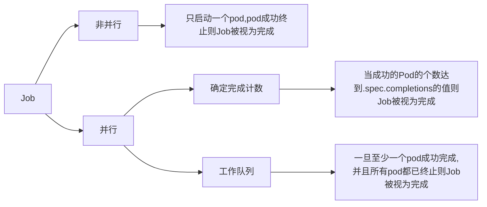

# Job

::: warning Job
当Pod在内部进程成功结束时，不重启容器。在发生节点故障时，由Job管理的Pod按照ReplicaSet的方式重新安排到其他节点（若`进程本身异常退出则重新启动容器`）。
:::

> 1. Job会创建一个或者多个Pod，并将继续重试Pod的执行，直到指定数量的Pod成功终止。 
> 2. 随着Pod成功结束，Job跟踪记录成功完成的Pod个数。 当数量达到指定的成功个数阈值时，任务（即Job）结束。 
> 3. 删除Job的操作会清除所创建的全部Pod。 挂起Job的操作会删除Job的所有活跃Pod，直到Job被再次恢复执行。

### Job的创建

```yaml
apiVersion: batch/v1
kind: Job
metadata:
  namespace: helloworld
  name: pi
spec:
  ttlSecondsAfterFinished: 200 # 当job完成后200s就清理这个job，如果设置为0那么在成功后立马清理，如果不设置默认不清理
  completions: 4 # 设置为0时job会被挂起
  parallelism: 2 # 默认值为1，用于表示Job执行任务的并行数。
  template:
    spec:
      containers:
        - name: pi
          image: perl:5.34
          command: ["perl",  "-Mbignum=bpi", "-wle", "print bpi(2000)"]
      restartPolicy: Never # 只能设置为Never或OnFailure
  backoffLimit: 4
```
#### Job并行执行


> 若`completion = 4`，`parallelism=2`，那么表示：按照2个pod同时启动的规则完成4个pod的成功运行即视为job已完成。

```yaml
apiVersion: batch/v1
kind: Job # 类型为Job
metadata:
	name: batch-job
spec:
	backoffLimit: 6 # job被标记为失败之前的重试次数，默认为6
    completions: 5  # 使得job顺序运行5个pod（如果其中失败一个，会重启一次，那么最终会超过5个）
    parallelism: 2 # pod并行运行的数量，job运行时最多有2个pod在运行
	template:
		metadata:
			labels:
				app: batch-job # 指定模板的label
		spec:
			activeDeadlineSeconds: 10 # 限制pod的运行时间，超过此时间会终止pod并标记为失败
			restartPolicy: OnFailure #重启策略不能时Always
			containers:
			- name: main
			  image: luksa/batch-job
```
```shell
# 创建job
kubectl apply -f job.yaml
# 查看job
kubectl get job
# 删除job，管理的pod也会被删除
kubectl delete job batch-job
# 修改job中pod的并行数量
kubectl edit job
```
> job管理的Pod任务完成后会显示`Completed`状态。

### CronJob
使用`cron`格式进行编写，`周期性`地在给定的调度时间创建并执行Job。

```yaml
apiVersion: batch/v1beta1
kind: CronJob # 类型为CronJob
metadata:
	name: batch-cron-job
spec:
	schedule: "*/1 * * * *"
	staringDeadlineSeconds: 15 # pod必须在指定时间后15s内开始运行
	jobTemplate:
		spec:
            template:
                metadata:
                    labels:
                        app: batch-job # 指定模板的label
                spec:
                    activeDeadlineSeconds: 10 # 限制pod的运行时间
                    restartPolicy: OnFailure #重启策略不能时Always
                    containers:
                    - name: main
                      image: luksa/batch-job
```
### Cron语法

```java
# ┌───────────── 分钟 (0 - 59)
# │ ┌───────────── 小时 (0 - 23)
# │ │ ┌───────────── 月的某天 (1 - 31)
# │ │ │ ┌───────────── 月份 (1 - 12)
# │ │ │ │ ┌───────────── 周的某天 (0 - 6)（周日到周一；在某些系统上，7 也是星期日）
# │ │ │ │ │                          或者是 sun，mon，tue，web，thu，fri，sat
# │ │ │ │ │
# │ │ │ │ │
# * * * * *
```