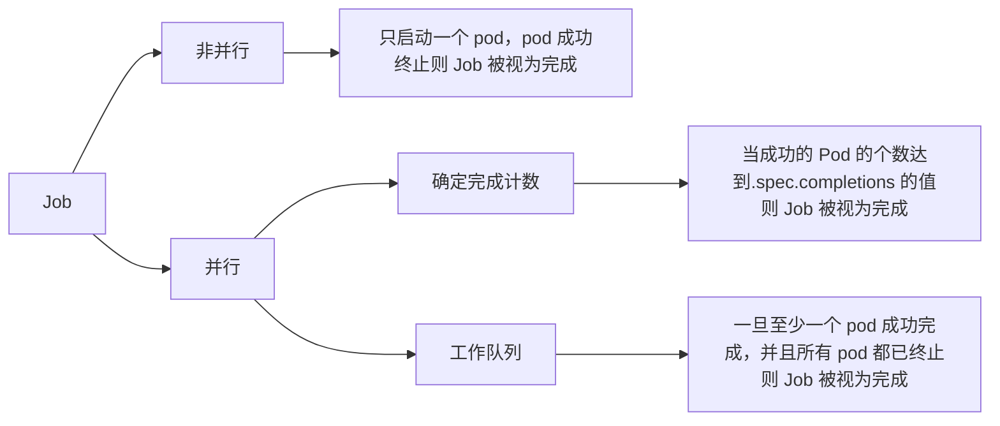

# Job

::: warning Job

当 Pod 内部进程成功结束时，不重启容器。在发生节点故障时，由 Job 管理的 Pod 按照 ReplicaSet 的方式重新安排到其他节点（若 `进程本身异常退出则重新启动容器`）。

:::

> 1. Job 会创建一个或者多个 Pod，并将继续重试 Pod 的执行，直到指定数量的 Pod 成功终止
> 2. 随着 Pod 成功结束，Job 跟踪记录成功完成的 Pod 个数。当数量达到指定的成功个数阈值时，任务（即 Job）结束
> 3. 删除 Job 的操作会清除所创建的全部 Pod。挂起 Job 的操作会删除 Job 的所有活跃 Pod，直到 Job 被再次恢复执行

## Job 的创建

```yaml
apiVersion: batch/v1
kind: Job
metadata:
  namespace: helloworld
  name: pi
spec:
  ttlSecondsAfterFinished: 200  # 当 job 完成后 200s 就清理这个 job，如果设置为 0 那么在成功后立即清理，如果不设置默认不清理
  completions: 4                # 设置为 0 时 job 会被挂起
  parallelism: 2                # 默认值为 1，用于表示 Job 执行任务的并行数
  template:
    spec:
      containers:
        - name: pi
          image: perl:5.34
          command: ["perl", "-Mbignum=bpi", "-wle", "print bpi(2000)"]
      restartPolicy: Never      # 只能设置为 Never 或 OnFailure
  backoffLimit: 4
```

### Job 并行执行


```mermaid
graph LR
A[Job] --> B[非并行]
A --> C[并行]
B --> D[只启动一个 pod，pod 成功终止则 Job 被视为完成]
C --> E[确定完成计数]
C --> F[工作队列]
E --> G[当成功的 Pod 的个数达到.spec.completions 的值则 Job 被视为完成]
F --> H[一旦至少一个 pod 成功完成，并且所有 pod 都已终止则 Job 被视为完成]
```

> 若 `completions = 4`，`parallelism=2`，那么表示：按照 2 个 pod 同时启动的规则完成 4 个 pod 的成功运行即视为 job 已完成

```yaml
apiVersion: batch/v1
kind: Job                         # 类型为 Job
metadata:
  name: batch-job
spec:
  backoffLimit: 6                 # job 被标记为失败之前的重试次数，默认为 6
  completions: 5                  # 使得 job 顺序运行 5 个 pod（如果其中失败一个，会重启一次，那么最终会超过 5 个）
  parallelism: 2                  # pod 并行运行的数量，job 运行时最多有 2 个 pod 在运行
  template:
    metadata:
      labels:
        app: batch-job            # 指定模板的 label
    spec:
      activeDeadlineSeconds: 10   # 限制 pod 的运行时间，超过此时间会终止 pod 并标记为失败
      restartPolicy: OnFailure    # 重启策略不能是 Always
      containers:
        - name: main
          image: luksa/batch-job
```

```shell
# 创建 job
kubectl apply -f job.yaml

# 查看 job
kubectl get job

# 删除 job，管理的 pod 也会被删除
kubectl delete job batch-job

# 修改 job 中 pod 的并行数量
kubectl edit job
```

> job 管理的 Pod 任务完成后会显示 `Completed` 状态

## CronJob

使用 `cron` 格式进行编写，`周期性` 地在给定的调度时间创建并执行 Job。

```yaml
apiVersion: batch/v1beta1
kind: CronJob                     # 类型为 CronJob
metadata:
  name: batch-cron-job
spec:
  schedule: "*/1 * * * *"
  startingDeadlineSeconds: 15     # pod 必须在指定时间后 15s 内开始运行
  jobTemplate:
    spec:
      template:
        metadata:
          labels:
            app: batch-job        # 指定模板的 label
        spec:
          activeDeadlineSeconds: 10  # 限制 pod 的运行时间
          restartPolicy: OnFailure   # 重启策略不能是 Always
          containers:
            - name: main
              image: luksa/batch-job
```

## Cron 语法

```text
# ┌───────────── 分钟 (0 - 59)
# │ ┌───────────── 小时 (0 - 23)
# │ │ ┌───────────── 月的某天 (1 - 31)
# │ │ │ ┌───────────── 月份 (1 - 12)
# │ │ │ │ ┌───────────── 周的某天 (0 - 6)（周日到周一；在某些系统上，7 也是星期日）
# │ │ │ │ │                          或者是 sun，mon，tue，web，thu，fri，sat
# │ │ │ │ │
# │ │ │ │ │
# * * * * *
```
