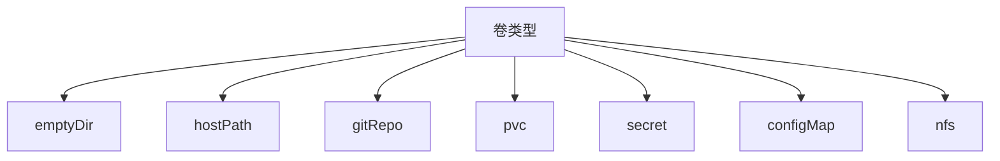

# Volume
::: warning 概念
- `Pod中的每个容器都有自己独立的文件系统`，k8s通过`定义存储卷`来实现Pod在重启后能够识别前一个容器写入卷的所有文件。
- k8s的卷是Pod的一个组成部分，不能单独创建和删除。Pod内的每个容器都可以使用卷，但必须要先将它挂载在每个需要访问它的容器中。
:::

### 卷的类型


| 类型     | 作用                                      |
| -------- | ----------------------------------------- |
| emptyDir | 用于存储临时数据的简单空目录              |
| hostPath | 用于将目录从工作节点的文件系统挂载到Pod中 |
| gitRepo  | 通过检出git仓库来初始化卷                 |
| pvc      | 挂载到 Pod 中，以实现数据的持久性存储       |
| nfs      | 挂载到Pod中的NFS共享卷                    |
| configmap| 存储环境变量、配置文件、应用程序参数等配置信息 |
| secret   | 存储数据库密码、API 密钥、TLS 证书等敏感信息。|

#### emptyDir

```yaml
apiVersion: v1
kind: Pod
metadata:
	name: fortune
spec:
	containers:
	- image: luksa/fortune
  	  name: html_generator
  	  volumeMounts:
  	  - name: html # 将html的卷挂载在容器内的/var/htdocs中
        mountPath: /var/htdocs
	- image: nginx:alpine
  	  name: web-server
      volumeMounts:
      - name: html # 将html的卷挂载在容器内的/usr/share/nginx/html中且是只读的
        mountPath: /usr/share/nginx/html
        readOnly: true
      ports:  # nginx暴露的端口号
      - containerPort: 80
        protocol:  TCP
    volumes: #创建名为html的emptyDir卷，挂载在上面两个容器中
	- name: html
  	  emptyDir: {}
  	# emptyDir:
  	  # medium: Memory # emptyDir的文件会被存储在内存中
```

> 在Pod中创建两个容器，基于挂载实现一个容器负责向指定目录写入文件内容，一个容器负责读取这个目录下的文件内容。

#### gitRepo

相比emptyDir，gitRepo只是最初用Git仓库的内容填充了emptyDir。但是并不能和对应的仓库进行同步，卷重的文件不会被更新，但如果Pod是基于ReplicationController（或ReplicaSet）进行管理，那么通过删除Pod，重新创建时卷则会包含最新的内容。

```yaml
apiVersion: v1
kind: Pod
metadata:
  name: gitrepo-volume-pod
spec:
  containers:
  - image: nginx:alpine # 创建nginx容器
    name: web-server
    volumeMounts:
    - name: html # 将html挂载到/usr/local/nginx/html目录下
      mountPath: /usr/local/nginx/html
      readOnly: true
    ports:
    - containerPort: 80
      protocol: TCP
  volumes:
  - name: html
    gitRepo: # 选择gitRepo
      repository: https://github.com/luksa/kubia-website-example.git
      revision: master # 分支
      directory: . # clone到根目录
```

> 或使用`gitsync sidecar`实现不删除重启容器，将更新内容挂载到目录实现动态更新。

#### hostPath

hostPath卷指向节点文件系统上的特定文件或者目录。在同一个节点上运行并在其hostPath卷中使用相同路径的Pod可以看到相同的文件。


> `hostPath`卷是`持久性`存储，之前的`emptyDir`和`gitRepo`都会随着Pod被删除时删除。
>
> 通常用于单节点集群中的持久化部署。

```yaml
apiVersion: v1
kind: Pod
metadata:
  name: nginx-hostpath
spec:
  containers:
  - image: nginx:alpine # 创建nginx容器
    name: web-server
    volumeMounts:
    - name: html
      mountPath: /usr/local/nginx/html
    ports:
    - containerPort: 80
      protocol: TCP
  volumes:
  - name: html
    hostPath:
      path: /opt/nginx # 挂载节点上的文件系统
      type: DirectoryOrCreate # 目录不存在就创建
#       type: FileOrCreate # 文件不存在就创建
```

> 我们需要查看Pod在哪个node节点，那么就去node节点上的文件系统查看。

#### emptyDir

当Pod分配到某个Node上时，`emptyDir`卷会被创建，并且在Pod在该节点上运行期间，卷一直存在。Pod中的容器都可以读写`emptyDir`卷中相同的文件（容器共享）。 当Pod因为某些原因被从节点上删除时，`emptyDir`卷中的数据也会被永久删除。

```yaml
apiVersion: v1
kind: Pod
metadata:
  name: test-emptydir
  namespace: helloworld
spec:
  containers:
  - image: nginx
    name: nginx
    resources:
      limits:
        cpu: 200m
        memory: 200Mi
      requests:
        cpu: 200m
        memory: 100Mi
    volumeMounts:
    - mountPath: /cache
      name: cache-volume
  volumes:
  - name: cache-volume
    emptyDir:  {}
#    emptyDir:
#      medium: Memory # 设置emptyDir为你挂载 tmpfs（基于 RAM 的文件系统），会计入容器的内存消耗
```

> 只要Pod一直存在不被删除，那么emptyDir也会一直存在（即使容器崩溃也不受影响）

#### gitRepo

相比emptyDir，gitRepo只是最初用Git仓库的内容填充了emptyDir。但是并不能和对应的仓库进行同步，卷重的文件不会被更新，但如果Pod是基于ReplicationController（或ReplicaSet）进行管理，那么通过删除Pod，重新创建时卷则会包含最新的内容。

```yaml
apiVersion: v1
kind: Pod
metadata:
  name: gitrepo-volume-pod
spec:
  containers:
  - image: nginx:alpine # 创建nginx容器
    name: web-server
    volumeMounts:
    - name: html # 将html挂载到/usr/local/nginx/html目录下
      mountPath: /usr/local/nginx/html
      readOnly: true
    ports:
    - containerPort: 80
      protocol: TCP
  volumes:
  - name: html
    gitRepo: # 选择gitRepo
      repository: https://github.com/luksa/kubia-website-example.git
      revision: master # 分支
      directory: . # clone到根目录
```

> 或使用`gitsync sidecar`实现不删除重启容器，将更新内容挂载到目录实现动态更新。

#### hostPath

`hostPath`卷能将主机节点文件系统上的文件或目录挂载到你的Pod中（因为存在安全风险，尽量避免使用hostPath）。

```yaml
apiVersion: v1
kind: Pod
metadata:
  name: test-hostpath
  namespace: helloworld
  labels:
    name: test-hostpath
spec:
  containers:
  - name: test-hostpath
    image: nginx
    resources:
      limits:
        memory: "128Mi"
        cpu: "100m"
    ports:
      - containerPort: 80
    volumeMounts:
      - mountPath: /root
        name: test-hostpath
  volumes:
    - name: test-hostpath
      hostPath:
        path: /root
        type: Directory # 必须存在root目录 type可以不填任何值，表明hostPath卷不会进行任何检查
```

- hostPath type

| 取值                | 含义                                                         |
| ------------------- | ------------------------------------------------------------ |
| `""`                | 默认值，这意味着在安装 hostPath 卷之前不会执行任何检查。     |
| `DirectoryOrCreate` | 如果在给定路径上什么都不存在，那么将创建空目录，权限设置为 0755 |
| `Directory`         | 在给定路径上必须存在的目录。                                 |
| `FileOrCreate`      | 如果在给定路径上什么都不存在，那么将创建空文件，权限设置为 0644 |
| `File`              | 在给定路径上必须存在的文件。                                 |
| `Socket`            | 在给定路径上必须存在的 UNIX 套接字。                         |
| `CharDevice`        | 在给定路径上必须存在的字符设备。                             |
| `BlockDevice`       | 在给定路径上必须存在的块设备。                               |

#### 持久卷与持久卷声明


> 当集群用户需要在其Pod使用持久化存储时，他们首先创建持久化声明（PersistentVolumeClaim）清单，指定所需要的`最低容量要求和访问模式`。
>
> 持久卷声明可以当作Pod中的一个卷来使用，其他用户不能使用相同的持久卷（除非先删除）。

##### 持久卷

`Persistent Volume（pv）`持久卷，相对于`Volumes`存储一些有必要保存的数据，它主要是为了管理集群的存储。且它相对于Pod独立创建。

```yaml
# 持久化卷
apiVersion: v1
kind: PersistentVolume
metadata:
  name: mongodb-pv
spec:
  capacity:
    storage: 200Mi
  volumeMode: Filesystem # 默认值，或设置Block（块设备）
  accessModes:
  - ReadWriteOnce # 被单个客户端挂载为读写模式
  - ReadOnlyMany # 被多个客户端挂载为读模式
 #- ReadWriteMany # 被多个客户端挂载为读写模式 
  persistentVolumeReclaimPolicy: Recycle # 当pvc被释放后的操作，pv被回收，或者Retain/delete保留
  storageClassName: ""
  local: # 基于本地的pv
    path: /opt # 本地磁盘的路径
  nodeAffinity: # 设置Node的亲和性
    required: # 使用此块pv的node必须在k8s-node1上
      nodeSelectorTerms:
      - matchExpressions:
        - key: kubernetes.io/hostname
          operator: In
          values:
          - k8s-node1
```

##### 持久卷声明

**`持久卷（PersistentVolume，PV）`** 是集群中的一块存储，可以由管理员事先制备，或者使用存储类（Storage Class）来动态制备。

**`持久卷声明（PersistentVolumeClaim，PVC）`** 表达的是用户对存储的请求。PVC可以请求特定大小和访问模式的PV。

> 1. 当用户创建一个特定容量与访问模式的PVC对象后，会被集群master节点上的控制回路监听到并找到合适的PV将他绑定到PVC上。
>
> 2. 如果是基于`storageclass`动态创建，那么在对应的PV卷创建后，控制回路也会将PV绑定到对应的PVC上。
>
> 3. 如果找不到合适的PV卷，那么PVC会无限期的处于未绑定状态，直到与之匹配的PVC卷出现。

```yaml
apiVersion: v1
kind: PersistentVolume
metadata:
  name: my-pv
  namespace: helloworld
spec:
  capacity:
    storage: 100Mi
  accessModes:
    - ReadWriteOnce # 卷可以被一个节点以读写方式挂载
  persistentVolumeReclaimPolicy: Delete
  volumeMode: Filesystem # 卷会被 Pod 挂载（Mount） 到某个目录 ，Block：将卷作为原始块设备来使用
  # hostPath:
  #   path: /root/helloworld # 绑定本地文件或目录
  claimRef: # 绑定pvc
    name: my-pvc
    namespace: helloworld
  storageClassName: mini-nfs-storageclass
  mountOptions:
    - hard
    - nfsvers=4.1
  nfs:
    path: /opt/share
    server: 10.50.8.38
---
apiVersion: v1
kind: PersistentVolumeClaim
metadata:
  name: my-pvc
spec:
  resources:
    requests:
      storage: 100Mi
  volumeMode: Filesystem
  accessModes:
    - ReadWriteOnce
  volumeName: my-pv
---
apiVersion: v1
kind: Pod
metadata:
  name: my-pod
  namespace: helloworld
spec:
  containers:
    - name: nginx
      image: nginx
      volumeMounts:
      - mountPath: "/var/www/html"
        name: nginx
      resources:
        limits:
          memory: 256Mi
          cpu: "1"
        requests:
          memory: 256Mi
          cpu: "0.2"
  volumes:
    - name: nginx
      persistentVolumeClaim:
        claimName: my-pvc # pod通过pvc来挂载存储
```

- PV访问模式

| 访问模式             | 含义                              |
| -------------------- | --------------------------------- |
| **ReadWriteOnce**    | 卷可以被一个节点以读写方式挂载。  |
| **ReadOnlyMany**     | 卷可以被多个节点以只读方式挂载。  |
| **ReadWriteMany**    | 卷可以被多个节点以读写方式挂载。  |
| **ReadWriteOncePod** | 卷可以被单个 Pod 以读写方式挂载。 |

- PV回收策略

| 回收策略         | 含义                                                      |
| ---------------- | --------------------------------------------------------- |
| **Retained**     | 当PVC对象被删除时，PV卷仍然存在，对应的数据被视为已释放。 |
| ~~**Recycled**~~ | 已被废弃。取而代之的建议方案是使用动态制备。              |
| **Deleted**      | 会将PV从集群中移除，默认回收策略。                        |

#### NFS

支持将NFS(网络文件系统)挂在到你的Pod中，nfs卷的内容在删除Pod时会被保存，卷只是被卸载。这意味着`nfs`卷可以被预先填充数据，并且这些数据可以在Pod之间共享。

> 需要先安装[nfs-client-provisioner](./nfs_volume.yaml)，一种自动配置卷程序，它使用现有的NFS服务来支持通过持久卷声明动态配置 Kubernetes 持久卷。

```yaml
apiVersion: v1
kind: PersistentVolumeClaim
metadata:
  name: nfs-pvc # pvc的名称
  namespace: helloworld
spec:
  accessModes:
    - ReadWriteMany
  storageClassName: "mini-nfs-storageclass" # 绑定 基于nfs-provisioner创建的storageClass
  resources:
    requests:
      storage: 100Mi
```

```yaml
apiVersion: apps/v1
kind: Deployment
metadata:
  name: nfs-volume
  namespace: helloworld
spec:
  replicas: 1
  selector:
    matchLabels:
      role: nfs-volume
  template:
    metadata:
      labels:
        role: nfs-volume
    spec:
      containers:
        - name: nfs-volume
          image: nginx
          ports:
            - name: nfs
              containerPort: 80
          volumeMounts:
            - mountPath: /www/
              name: mypvc
          resources:
            limits:
              memory: 256Mi
              cpu: "0.5"
            requests:
              memory: 256Mi
              cpu: "0.2"
      volumes:
        - name: mypvc
          persistentVolumeClaim:
            claimName: nfs-pvc # 指定基于nfs创建的pvc的名称
```

#### configMap
configMap用于存储非敏感的数据，比如配置文件，环境变量等。

```yaml
# 保存数据大小不能超过１MiB
apiVersion: v1
kind: ConfigMap
metadata:
  name: test-configmap
  namespace: helloworld
immutable: false # true表示配置文件不可修改,只能删除重建
data:
  "hello": "world" # 保存为u8编码的文件
  "hello.properties": |- # 管道符表示绑定多行文本
    hello=world
    a=b
binaryData:
  "hello2": SGVsbG8gd29ybGQhCg== #　base64编码后的二进制数据，key不能与data中的相同
---
apiVersion: apps/v1
kind: Deployment
metadata:
  name: test-config
  namespace: helloworld
  labels:
    app: test-config
spec:
  replicas: 1
  selector:
    matchLabels:
      app: test-config
  template:
    metadata:
      name: test-config
      labels:
        app: test-config
    spec:
      containers:
        - name: test-config
          image: abcsys.cn:5000/public/alpine
          command:
            - sleep
            - "3600"
          imagePullPolicy: IfNotPresent
          resources:
            requests:
              cpu: 100m
              memory: 32Mi
            limits:
              cpu: 1000m
              memory: 64Mi
          env:
            - name: config-from-configmap
              valueFrom:
                configMapKeyRef:
                  name: test-configmap # configmap name
                  key: hello # 变更不会通知到pod
          volumeMounts: # 挂载的方式绑定configmap
            - mountPath: /config
              name: mount-from-config
              readOnly: true
            - name: binary-data
              mountPath: /config/binary-data
      volumes:
        - name: mount-from-config
          configMap:
            name: test-configmap
            items: # 下述会被创建为文件,且变更的时候会通知到pod
              - key: "hello.properties"
                path: "hello.properties"
        - name: binary-data
          configMap:
            name: test-configmap # configmap中的每一个key都做为一个单独的文件绑定到/config/binary-data目录下
      restartPolicy: Always  
```
> 1. configMap中的value作为环境变量时，他的改动不会通知到pod.
> 2. configMap中的value使用volumeMounts挂载文件的形式绑定，改动则会通知pod(subPath除外)．

#### secret
secret用于存储敏感数据，并使用base64编码．

```yaml
# 保存数据大小不能超过１MiB
apiVersion: v1
kind: Secret
metadata:
  name: test-secret
  namespace: helloworld
type: Opaque # 用户定义的任意数据，不传默认为Opaque
immutable: true
data:
  "hello": d29ybGQ=
stringData: # 表示明文存储
  "hello2": "world2"
---
# kubectl create secret docker-registry/tls ${secret_name} --cert=${cert_path} --key=${key_path}
apiVersion: v1
kind: Secret
metadata:
  name: test-secret2
  namespace: helloworld
type: kubernetes.io/dockerconfigjson # 访问镜像仓库的凭证
data:
  .dockerconfigjson: eyJhdXRocyI6eyJhdXRoIjoicGFzc3dvcmQifX0=
---
apiVersion: apps/v1
kind: Deployment
metadata:
  name: test-config
  namespace: helloworld
  labels:
    app: test-config
spec:
  replicas: 1
  selector:
    matchLabels:
      app: test-config
  template:
    metadata:
      name: test-config
      labels:
        app: test-config
    spec:
      containers:
        - name: test-config
          image: abcsys.cn:5000/public/alpine
          command:
            - sleep
            - "3600"
          imagePullPolicy: IfNotPresent
          resources:
            requests:
              cpu: 100m
              memory: 32Mi
            limits:
              cpu: 1000m
              memory: 64Mi
          env:
            - name: config-from-secret
              valueFrom:
                secretKeyRef:
                  name: test-secret
                  key: hello
          volumeMounts: # 挂载的方式绑定configmap
            - name: secret-volume
              mountPath: /config/secret
      volumes:
        - name: secret-volume
          secret:
            secretName: test-secret
            items:
              - key: "hello"
                path: "hello.secret"
      restartPolicy: Always
```
> 1. 挂载到pod的value会在自动被解密为明文．

#### subPath
单个pod中一个共享卷供多个容器挂载使用，subPath属性可用于指定所引用的卷内的子路径，而不是根路径．主要用于`一个卷挂载多个路径或挂载特定目录的特定路径，并希望容器内原有目录不被覆盖`
```yaml
apiVersion: v1
kind: Pod
metadata:
  name: my-nginx-subpath1
  namespace: helloworld
  labels:
    name: my-nginx-subpath
spec:
  containers:
  - name: my-nginx-subpath
    image: abcsys.cn:5000/public/nginx
    resources:
      limits:
        memory: "128Mi"
        cpu: "100m"
    ports:
      - containerPort: 80
    volumeMounts:
      - mountPath: /var/log/nginx/hello.properties
        name: nginx-mount
        subPath: hello.properties # 挂载hello.properties到容器内，与原有内容并存，否则会覆盖
  volumes:
    - name: nginx-mount
      configMap:
        name: test-configmap
        items:
          - key: "hello.properties"
            path: "hello.properties"
```
#### subPathExpr
使用subPathExpr字段可以基于`Downward api`环境变量实现构造subPath目录名，与subPath是互斥的

```yaml
apiVersion: v1
kind: Pod
metadata:
  name: my-nginx-subpath3
  namespace: helloworld
  labels:
    name: my-nginx-subpath
spec:
  containers:
    - name: my-nginx-subpath
      image: abcsys.cn:5000/public/alpine
      command: [ "sh", "-c", "while [ true ]; do echo 'Hello'; sleep 10; done | tee -a /logs/hello.txt" ]
      env:
        - name: POD_NAME
          valueFrom:
            fieldRef:
              apiVersion: v1
              fieldPath: metadata.name
      volumeMounts:
        - mountPath: /logs
          name: mount
          subPathExpr: $(POD_NAME) # 支持环境变量
  volumes:
    - name: mount
      hostPath:
        path: /var/log/pods
```
