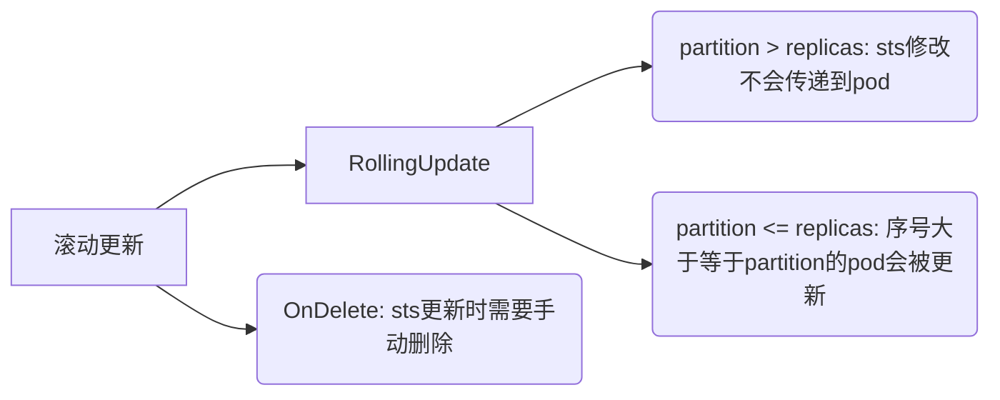

# StatefulSet
::: warning 概念

- StatefulSet 是用来管理`有状态应用`的工作负载 API 对象。管理某些pod集合的部署和扩缩，并为这些pod提供持久存储和持久标识符。
- 每个Pod维护了一个有粘性的ID。这些Pod是基于相同的规约来创建的，但是不能相互替换：`无论怎么调度，每个Pod都有一个永久不变的ID`。
- 修改StatefulSet的配置后并不会重新启动Pod（删除Pod可以触发）。
> 
:::

### 基于PV创建StatefulSet
```yaml
# 需要创建持久卷,statefulset里面几个副本就创建几个持久卷
apiVersion: v1
kind: PersistentVolume
metadata:
  name: pv
spec:
  capacity:
    storage: 200Mi
  volumeMode: Filesystem # 默认值，或设置Block（块设备）
  accessModes:
  - ReadWriteOnce # 被单个客户端挂载为读写模式
  - ReadOnlyMany # 被多个客户端挂载为读模式
  - ReadWriteMany # 被多个客户端挂载为读写模式 
  persistentVolumeReclaimPolicy: Recycle # 当pvc被释放后的操作，pv被回收
  local:
    path: /opt # 本地磁盘的路径
  nodeAffinity: # 设置Node的亲和性
    required: # 使用此块pv的node必须在k8s-node1上
      nodeSelectorTerms:
      - matchExpressions:
        - key: kubernetes.io/hostname
          operator: In
          values:
          - k8s-node1
---
# 需要先创建用于有状态Pod之间提供网络标识的headless service
apiVersion: v1
kind: Service
metadata:
  name: kubia-stateful
spec:
  clusterIP: None # headless核心
  selector:
    app: kubia
  ports:
  - name: http
    port: 80
---
# statefulSet
apiVersion: apps/v1beta1
kind: StatefulSet
metadata:
  name: kubia-stateful
spec:
  serviceName: kubia
  replicas: 2
  selector:
    matchLabels:
      app: kubia
  template:
    metadata:
      labels:
        app: kubia
    spec:
      containers:
      - name: kubia
        image: luksa/kubia-pet
        ports:
        - name: http
          containerPort: 8080
        volumeMounts:
        - name: data
          mountPath: /var/data
  volumeClaimTemplates:
  - metadata:
      name: data
    spec:
      resources:
        requests:
          storage: 1Mi
      accessModes:
      - ReadWriteOnce
```

> `statefulSet`会等到第一个Pod启动完毕后才会启动第二个Pod。如果某个Pod被删除，那么statefulSet会创建一个新的Pod（标识符、存储相同的新Pod，`新旧Pod不一定会在一个node上`）。
>
> 
>
> 我们可以通过`curl -X POST -d "Hey there! This greeting was submitted to kubia-0. " localhost:8001/api/v1/namespaces/default/pods/kubia-stateful-0/proxy/`前后访问两次来判断新旧Pod是否使用相同的存储空间和标识符。
>
> 如果我们需要对statefulSet进行缩容，那么会`优先删除索引值高`

### 基于SC创建StatefulSet

```yaml
apiVersion: storage.k8s.io/v1
kind: StorageClass
metadata:
    name: mini-storage-class
    namespace: helloworld
parameters:
    server: 10.50.8.38
    share: /opt/share
provisioner: nfs.csi.k8s.io
reclaimPolicy: Retain
volumeBindingMode: Immediate
---
apiVersion: v1
kind: Service
metadata:
    name: nginx
    namespace: helloworld
    labels:
        app: nginx
spec:
    ports:
        -   port: 80
            name: web
    clusterIP: None # 设置无头模式，不需要负载均衡
    selector:
        app: nginx
---
apiVersion: apps/v1
kind: StatefulSet
metadata:
    name: web
    namespace: helloworld
spec:
    selector:
        matchLabels:
            app: nginx # 必须匹配 .spec.template.metadata.labels
    serviceName: "nginx"
    replicas: 1
    podManagementPolicy: OrderReady # 默认
    updateStrategy:
        type: RollingUpdate # 滚动更新，遵循销毁和创建顺序，若值为onDelete将不再自动更新pod，需要手动删除和创建
        rollingUpdate:
          partition: 1 # 序号为>=1的pod在.spec.template改动时滚动更新pod
    template:
        metadata:
            labels:
                app: nginx # 必须匹配 .spec.selector.matchLabels
        spec:
            terminationGracePeriodSeconds: 10
            containers:
                -   name: nginx
                    image: lowyard/nginx-slim
                    ports:
                        -   containerPort: 80
                            name: web
                    volumeMounts:
                        -   name: www
                            mountPath: /usr/share/nginx/html
    volumeClaimTemplates:
        -   metadata:
                name: www
            spec:
                accessModes: [ "ReadWriteOnce" ]
                storageClassName: "mini-storage-class"
                resources:
                    requests:
                        storage: 1Gi
```
### StatefuleSet创建与销毁顺序

1. N个副本的StatefuleSet，创建顺序是`0,1,2...N-1`。
2. N个副本的StatefuleSet，销毁的顺序是`N-1...2,1,0`。
3. 当第a个pod部署前，第a个pod前的所有pod必须处于running和ready状态。
4. 当第a-1个pod销毁前，第a个pod必须已经被终止和删除。

### StatefuleSet参数

#### updateStrategy


#### podManagementPolicy

默认是OrderReady，即上文默认的创建、销毁和扩缩顺序，如果设置为`Parallel`，会导致pod的`扩缩`过程中无需等待对应的pod进入准备或销毁状态。
