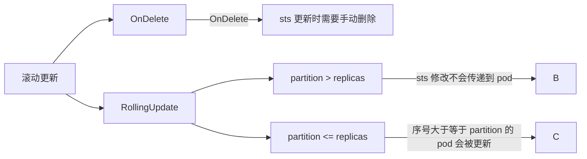

# StatefulSet

::: warning 概念

- StatefulSet 是用来管理 `有状态应用` 的工作负载 API 对象。管理某些 Pod 集合的部署和扩缩，并为这些 Pod 提供持久存储和持久标识符
- 每个 Pod 维护了一个有粘性的 ID。这些 Pod 是基于相同的规约来创建的，但是不能相互替换：`无论怎么调度，每个 Pod 都有一个永久不变的 ID`
- 修改 StatefulSet 的配置后并不会重新启动 Pod（删除 Pod 可以触发）

> 

:::

## 基于 PV 创建 StatefulSet

```yaml
# 需要创建持久卷，statefulSet 里面几个副本就创建几个持久卷
apiVersion: v1
kind: PersistentVolume
metadata:
  name: pv
spec:
  capacity:
    storage: 200Mi
  volumeMode: Filesystem                 # 默认值，或设置 Block（块设备）
  accessModes:
    - ReadWriteOnce                      # 被单个客户端挂载为读写模式
    - ReadOnlyMany                       # 被多个客户端挂载为读模式
    - ReadWriteMany                      # 被多个客户端挂载为读写模式
  persistentVolumeReclaimPolicy: Recycle # 当 pvc 被释放后的操作，pv 被回收
  local:
    path: /opt                           # 本地磁盘的路径
  nodeAffinity:                          # 设置 Node 的亲和性
    required:                            # 使用此块 pv 的 node 必须在 k8s-node1 上
      nodeSelectorTerms:
        - matchExpressions:
            - key: kubernetes.io/hostname
              operator: In
              values:
                - k8s-node1
---
# 需要先创建用于有状态 Pod 之间提供网络标识的 headless service
apiVersion: v1
kind: Service
metadata:
  name: kubia-stateful
spec:
  clusterIP: None                        # headless 核心
  selector:
    app: kubia
  ports:
    - name: http
      port: 80
---
# StatefulSet
apiVersion: apps/v1beta1
kind: StatefulSet
metadata:
  name: kubia-stateful
spec:
  serviceName: kubia
  replicas: 2
  selector:
    matchLabels:
      app: kubia
  template:
    metadata:
      labels:
        app: kubia
    spec:
      containers:
        - name: kubia
          image: luksa/kubia-pet
          ports:
            - name: http
              containerPort: 8080
          volumeMounts:
            - name: data
              mountPath: /var/data
  volumeClaimTemplates:
    - metadata:
        name: data
      spec:
        resources:
          requests:
            storage: 1Mi
        accessModes:
          - ReadWriteOnce
```

> `StatefulSet` 会等到第一个 Pod 启动完毕后才会启动第二个 Pod。如果某个 Pod 被删除，那么 StatefulSet 会创建一个新的 Pod（标识符、存储相同的新 Pod，`新旧 Pod 不一定会在一个 node 上`）
>
> 
>
> 我们可以通过 `curl -X POST -d "Hey there! This greeting was submitted to kubia-0." localhost:8001/api/v1/namespaces/default/pods/kubia-stateful-0/proxy/` 前后访问两次来判断新旧 Pod 是否使用相同的存储空间和标识符
>
> 如果我们需要对 StatefulSet 进行缩容，那么会 `优先删除索引值高` 的 Pod

## 基于 SC 创建 StatefulSet

```yaml
apiVersion: storage.k8s.io/v1
kind: StorageClass
metadata:
  name: mini-storage-class
  namespace: helloworld
parameters:
  server: 10.50.8.38
  share: /opt/share
provisioner: nfs.csi.k8s.io
reclaimPolicy: Retain
volumeBindingMode: Immediate
---
apiVersion: v1
kind: Service
metadata:
  name: nginx
  namespace: helloworld
  labels:
    app: nginx
spec:
  ports:
    - port: 80
      name: web
  clusterIP: None                        # 设置无头模式，不需要负载均衡
  selector:
    app: nginx
---
apiVersion: apps/v1
kind: StatefulSet
metadata:
  name: web
  namespace: helloworld
spec:
  selector:
    matchLabels:
      app: nginx                         # 必须匹配 .spec.template.metadata.labels
  serviceName: "nginx"
  replicas: 1
  podManagementPolicy: OrderReady        # 默认
  updateStrategy:
    type: RollingUpdate                  # 滚动更新，遵循销毁和创建顺序，若值为 OnDelete 将不再自动更新 pod，需要手动删除和创建
    rollingUpdate:
      partition: 1                       # 序号为>=1 的 pod 在 .spec.template 改动时滚动更新 pod
  template:
    metadata:
      labels:
        app: nginx                       # 必须匹配 .spec.selector.matchLabels
    spec:
      terminationGracePeriodSeconds: 10
      containers:
        - name: nginx
          image: lowyard/nginx-slim
          ports:
            - containerPort: 80
              name: web
          volumeMounts:
            - name: www
              mountPath: /usr/share/nginx/html
  volumeClaimTemplates:
    - metadata:
        name: www
      spec:
        accessModes: ["ReadWriteOnce"]
        storageClassName: "mini-storage-class"
        resources:
          requests:
            storage: 1Gi
```

## StatefulSet 创建与销毁顺序

1. N 个副本的 StatefulSet，创建顺序是 `0, 1, 2...N-1`
2. N 个副本的 StatefulSet，销毁的顺序是 `N-1...2, 1, 0`
3. 当第 a 个 Pod 部署前，第 a 个 Pod 前的所有 Pod 必须处于 Running 和 Ready 状态
4. 当第 a-1 个 Pod 销毁前，第 a 个 Pod 必须已经被终止和删除

## StatefulSet 参数

### updateStrategy


```mermaid
graph LR
滚动更新 --> RollingUpdate
滚动更新 --> OnDelete
OnDelete --> |OnDelete| A[sts 更新时需要手动删除]
RollingUpdate --> step1
RollingUpdate --> step2
step1[partition > replicas] --> |sts 修改不会传递到 pod | B
step2[partition <= replicas] --> |序号大于等于 partition 的 pod 会被更新 | C
```

### podManagementPolicy

默认是 `OrderReady`，即上文默认的创建、销毁和扩缩顺序。如果设置为 `Parallel`，会导致 Pod 的 `扩缩` 过程中无需等待对应的 Pod 进入准备或销毁状态。
