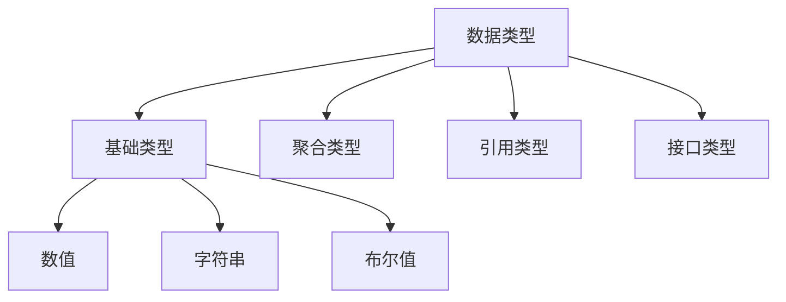

# 基本数据类型




> go的基础类型主要包含`整数、浮点数、复数、布尔值和字符串`。

#### 整数

有符号分为int8、int16、int32、int64，无符号分为uint8、uint16、uint32、uint64。

```go
func bit() {
	/*
			 1<<1: 00000001 -> 00000010
			 1<<5: 00000001 -> 00100000
			 或运算：有1为1否则为0
			  00000010
			| 00100000
			————————————
		      00100010
	*/
	var x uint8 = 1<<1 | 1<<5
	fmt.Printf("%08b\n", x) // 00100010
	fmt.Printf("%d\n", x)   // 34
}
```


> 1. 有符号和无符号的区别在于`最高位是否是符号位`，n位数字的取值范围是`-2^n-1 ~ 2^(n-1) -1`，无符号的取值范围是`0 ~ 2^n -1`
> 2. int默认是32位，但是`int32不等于int`，需要显示转换。
> 3. int32可以用`rune`表示，int8可以用`byte`表示。

#### 浮点数

go具有两种大小的浮点数：`float32和float64`，最大值分别是`math.MaxFloat32、math.MaxFloat64`。

```go
func float() {
	var f32 float32 = math.MaxFloat32
	var f64 float64 = math.MaxFloat64

	fmt.Printf("f32: %8.1f\n", f32) // 8表示输出的值不足8个字符，则会用空格填充 1表示保留小数点后1位
	fmt.Println(f64)
}
```

#### 布尔值

go中的bool值只有两种可能：true或false。布尔值取反前面加`!`。

#### 字符串

字符串是`不可变`的字节序列，他可以包含任意数据，包括0值字节。

```go
func str() {
	s := "你好世界"     // 默认按照utf8进行编码
	fmt.Println(len(s)) // 输出字符数量

	// 获取utf8下字符的编码值
	for i := 0; i < len(s); {
		r, size := utf8.DecodeRuneInString(s[i:])
		fmt.Printf("Character: %c, Code: %d\n", r, r)
		i += size
	}

	/*
		获取utf8下字符的编码值
		Character: 你, Code: [228 189 160]
		Character: 好, Code: [229 165 189]
		Character: 世, Code: [228 184 150]
		Character: 界, Code: [231 149 140]
		如果只包含ascii字符，那么直接通过s[i]来获取
	*/
	for _, char := range s {
		fmt.Printf("Character: %c, bytes: %v\n", char, []byte(string(char)))

	}

	fmt.Println(s[0], s[7])     // 通过下标访问，返回的是uint8类型的字节编码，即228和184
	fmt.Println(s[0:6])         // 默认会输出字符
	fmt.Println([]byte(s[0:5])) // 输出rune字节数组
	
	// 字符串的不可变性，a和b共用了底层字节数组
	a := "a"
	b := a
	a += "b"
	fmt.Println(a)
	fmt.Println(b)
    
    // []byte和string互转
    x := "abc"
	y := []byte(x)
	z := string(y)
	fmt.Printf("x: %s, y: %v, z: %s", x, y, z)
}
```

> 1. go中基于unicode（每个字符都有一个码点值，可用整数表示）设计出`rune`类型，底层是`int32（4个字节）`，用来容纳任意的unicode字符。
> 2. 在ASCII编码下，可以通过`[索引地址]`的方式获取字符，若是UTF8的编码下，因为其是`多个字节`组成的，此方法获取的是某个字符中的某个字节。
> 3. 可以通过`utf8.DecodeRuneInString`获取中文字符中的第一个字符。
> 4. 字符串是`不可变`的，类似java的字符串常量池，go的底层使用了字节数组。两个字符串可以安全的共用同一段底层内存。
>
> 

#### 常量

常量是一种表达式，可以保证在编译阶段就计算出表达式的值，并不需要等到运行时，从而是编译器得以知晓其值。常量本质上都属于基本类型，布尔型、字符串或者数字。

```go
func constant() {
	const hello string = "hello" // 定义string类型的常量
	const (
		a int = iota // 从0依次曾增加1
		b
		c
		d
	)
	fmt.Println(a, b, c, d) // 0 1 2 3

	const t = 10                                // 无类型常量，会根据上下文确认转为不同的类型
	fmt.Printf("type: %T, v: %d\n", t+1, t+1)   // 此时t是int类型
	fmt.Printf("type: %T, v: %f", t+0.1, t+0.1) // 此时t是float64类型
}
```

> 1. 不定义类型的常量，在使用时会根据上下文根据判断会转为不同的类型。
> 2. 可以一次定义多个常量，基于iota实现自动增长。