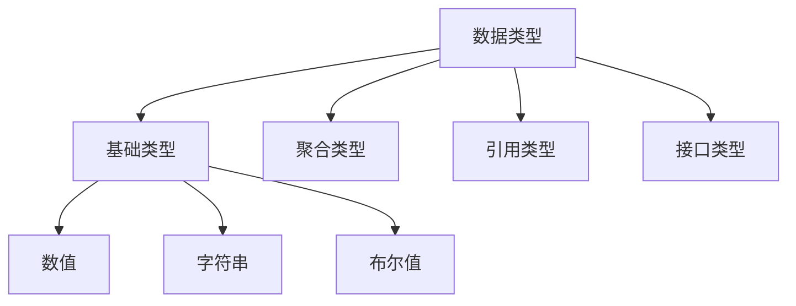

# 基本数据类型


```mermaid
graph TD
    A[数据类型] --> B[基础类型]
    A[数据类型] --> C[聚合类型]
    A[数据类型] --> D[引用类型]
    A[数据类型] --> E[接口类型]
    B[基础类型] --> F[数值]
    B[基础类型] --> G[字符串]
    B[基础类型] --> H[布尔值]
```

> Go 的基础类型主要包含 `整数、浮点数、复数、布尔值和字符串`

## 整数

有符号分为 int8、int16、int32、int64，无符号分为 uint8、uint16、uint32、uint64。

```go
func bit() {
    /*
         1<<1: 00000001 -> 00000010
         1<<5: 00000001 -> 00100000
         或运算：有 1 为 1 否则为 0
          00000010
        | 00100000
        ————————
          00100010
    */
    var x uint8 = 1<<1 | 1<<5
    fmt.Printf("%08b\n", x) // 00100010
    fmt.Printf("%d\n", x)   // 34
}
```

> 1. 有符号和无符号的区别在于 `最高位是否是符号位`，n 位数字的取值范围是 `-2^n-1 ~ 2^(n-1) -1`，无符号的取值范围是 `0 ~ 2^n -1`
> 2. int 默认是 32 位，但是 `int32 不等于 int`，需要显示转换
> 3. int32 可以用 `rune` 表示，int8 可以用 `byte` 表示

## 浮点数

Go 具有两种大小的浮点数：`float32 和 float64`，最大值分别是 `math.MaxFloat32、math.MaxFloat64`。

```go
func float() {
    var f32 float32 = math.MaxFloat32
    var f64 float64 = math.MaxFloat64

    // 8 表示输出的值不足 8 个字符，则会用空格填充；1 表示保留小数点后 1 位
    fmt.Printf("f32: %8.1f\n", f32)
    fmt.Println(f64)
}
```

## 布尔值

Go 中的 bool 值只有两种可能：true 或 false。布尔值取反前面加 `!`。

## 字符串

字符串是 `不可变` 的字节序列，它可以包含任意数据，包括 0 值字节。

```go
func str() {
    s := "你好世界"  // 默认按照 utf8 进行编码
    fmt.Println(len(s)) // 输出字符数量

    // 获取 utf8 下字符的编码值
    for i := 0; i < len(s); {
        r, size := utf8.DecodeRuneInString(s[i:])
        fmt.Printf("Character: %c, Code: %d\n", r, r)
        i += size
    }

    /*
       获取 utf8 下字符的编码值
       Character: 你，Code: [228 189 160]
       Character: 好，Code: [229 165 189]
       Character: 世，Code: [228 184 150]
       Character: 界，Code: [231 149 140]
       如果只包含 ascii 字符，那么直接通过 s[i] 来获取
    */
    for _, char := range s {
        fmt.Printf("Character: %c, bytes: %v\n", char, []byte(string(char)))
    }

    fmt.Println(s[0], s[7])     // 通过下标访问，返回的是 uint8 类型的字节编码，即 228 和 184
    fmt.Println(s[0:6])         // 默认会输出字符
    fmt.Println([]byte(s[0:5])) // 输出 rune 字节数组

    // 字符串的不可变性，a 和 b 共用了底层字节数组
    a := "a"
    b := a
    a += "b"
    fmt.Println(a)
    fmt.Println(b)

    // []byte 和 string 互转
    x := "abc"
    y := []byte(x)
    z := string(y)
    fmt.Printf("x: %s, y: %v, z: %s", x, y, z)
}
```

> 1. Go 中基于 unicode（每个字符都有一个码点值，可用整数表示）设计出 `rune` 类型，底层是 `int32（4 个字节）`，用来容纳任意的 unicode 字符
> 2. 在 ASCII 编码下，可以通过 `[索引地址]` 的方式获取字符，若是 UTF8 的编码下，因为其是 `多个字节` 组成的，此方法获取的是某个字符中的某个字节
> 3. 可以通过 `utf8.DecodeRuneInString` 获取中文字符中的第一个字符
> 4. 字符串是 `不可变` 的，类似 Java 的字符串常量池，Go 的底层使用了字节数组。两个字符串可以安全的共用同一段底层内存
>
> 

## 常量

常量是一种表达式，可以保证在编译阶段就计算出表达式的值，并不需要等到运行时，从而是编译器得以知晓其值。常量本质上都属于基本类型：布尔型、字符串或者数字。

```go
func constant() {
    const hello string = "hello" // 定义 string 类型的常量
    const (
        a int = iota // 从 0 依次增加 1
        b
        c
        d
    )
    fmt.Println(a, b, c, d) // 0 1 2 3

    const t = 10                              // 无类型常量，会根据上下文转为不同的类型
    fmt.Printf("type: %T, v: %d\n", t+1, t+1) // 此时 t 是 int 类型
    fmt.Printf("type: %T, v: %f", t+0.1, t+0.1) // 此时 t 是 float64 类型
}
```

> 1. 不定义类型的常量，在使用时会根据上下文判断转为不同的类型
> 2. 可以一次定义多个常量，基于 iota 实现自动增长
