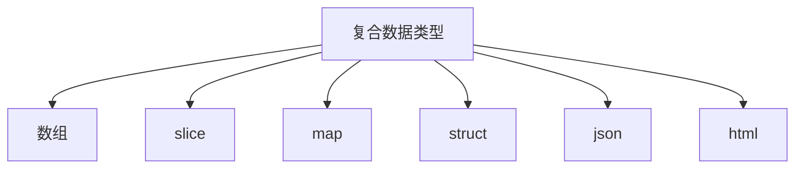

# 复合数据类型



#### 数组

数组是具有`固定长度`且拥有n个(n>=0)`相同数据类型`元素的序列。数组中的元素都是通过索引来访问的。

```go
func array() {
	arr := []int{1, 2, 3} // 初始化数组
	arr[2] = 4            // 修改index为2的值为4
	for i, a := range arr {
		fmt.Printf("index: %d, value: %d\n", i, a)
	}

	var arr2 [3]int                   // 定义3个整数的数组，默认初始化为零值
	arr2 = [...]int{1, 2, 3}          // 数组的字面量是...时 表示其值由初始化数组的个数决定
	arr2 = [...]int{0: 1, 1: 2, 2: 3} // 分别指定index为0的值为1，以此类推
	arr2 = [...]int{2: 3}             // 指定index为2的值为3，此时数组是三个元素，其他都是零值
	for i, a := range arr2 {
		fmt.Printf("index: %d, value: %d\n", i, a)
	}
	fmt.Printf("type: %T\n", arr2) // [3]int

	arr3 := [...]int{1, 2, 3}
	fmt.Printf("arr2 type: %T, arr3 type: %T, equals?: %t\n", arr2, arr3, arr2 == arr3) // false
}

/*
证明函数参数是值传递方式
*/
func transfer() {
	arr := [...]int{1, 2, 3}
	fmt.Printf("before arr value: %d, type: %T, location: %p\n", arr, arr, &arr) // 打印arr的地址和值
	modifyValue(arr)
	fmt.Printf("after arr value: %d, type: %T, location: %p\n", arr, arr, &arr) 
	modifyValue3(&arr) // 传递指针会修改源数据的值
	fmt.Printf("after arr value: %d, type: %T, location: %p\n", arr, arr, &arr)
}
/*
修改传递的数组里面的元素值
*/
func modifyValue(array [3]int) {
	fmt.Printf("modify arr value: %d, type: %T, location: %p\n", array, array, &array)
	array[0] = 100
}
/*
使用指针作为参数，会修改源数组
*/
func modifyValue3(p *[3]int) {
	fmt.Printf("modify2 arr value: %d, type: %T, location: %p\n", *p, *p, p)
	p[0] = 101
}
```

> 1. 数组初始化时不指定初始化值会默认设置为`零值`，使用`...`替代数组字面量值，大小默认由`数组初始化值数量`决定。
> 2. 数组字面量是数组类型的一部分，`[3]int != [4]int`。
> 3. 数组作为函数的形参时，是基于`值传递`实现传参（即将数组复制一份作为函数的参数），所以对形参的修改不会影响实参。
> 4. 若将`数组的指针`作为参数的形参，那么对其进行修改时，会影响到原始数组。

#### slice

slice表示一个拥有相同类型元素的`可变长度`的序列（参考java的List、python的切片）。用来访问数组的部分或者全部的元素。这个数组被成为slice的`底层数组`，slice是具备三个属性：`指针`、`长度`和`容量`的轻量级数据结构。


> 1. 指针指向数组的第一个可以从slice中访问的元素（并不一定是数组的第一个元素）。
> 2. 长度是指slice中的元素个数，不能超过slice的容量（cap）。
> 3. 容量的大小默认由`slice的起始元素到底层数组的最后一个元素`间元素的个数。
>
> 4. slice可以理解成数组的别名，`slice并不存储数据`，其作为形参传递时，对slice的修改`会影响到底层数组`。

```go
func sliceTest() {
	months := [...]string{
		1: "January", "February", "March", "April",
		"May", "June", "July", "August",
		"September", "October", "November", 12: "December",
	}
	fmt.Printf("type: %T, len: %d\n", months, len(months)) // [13]string 表示数组

	m1 := months[1:3]                                                // 1,2不包含3
	fmt.Printf("type: %T, len: %d, cap: %d\n", m1, len(m1), cap(m1)) // []string 表示slice cap表示slice的容量 len=2 cap=12

	m1[0] = "temp"
	fmt.Printf("type: %T, m1[0]: %s， month[0]: %s\n", m1, m1[0], months[0]) // slice包含指向底层数组的指针，无论是slice改变或者底层数组改变都会互相影响

	s1 := make([]int, 3) // 使用make创建slice，如果不指定cap，默认等于len，底层数组长度为3，且默认设置元素为零值
	fmt.Println(s1)

	s2 := []int(nil) // 将nil作为slice的元素，没有对应的底层数组，且长度和容量都为0
	s3 := []int{}    // 初始化空slice，不为nil
	var s4 []int = nil
	fmt.Printf("s2 == nil: %t, len(s2): %d\n", s2 == nil, len(s2)) // true 0
	fmt.Printf("s3 == nil: %t, len(s3): %d\n", s3 == nil, len(s3)) // false 0
	fmt.Printf("s4 == nil: %t, len(s4): %d\n", s4 == nil, len(s4)) // true 0
    
    fmt.Println(appendInt([]int{1, 2, 3}, 4, 5, 6)) // 添加4,5,6到slice末尾
}
/*
将y追加到[]int后
需要考虑到cap 扩容问题
其功能等同于 append()
*/
func appendInt(x []int, y ...int) []int {
	var z []int
	zlen := len(x) + len(y)
	if zlen <= cap(x) {
		z = x[:zlen] // 扩容len(y)
	} else {
		zcap := zlen // zlen > zcap 说明底层数组容量不够需要扩容了
		if zcap < zlen<<1 {
			zcap = zlen << 1 // 扩容2倍

		}
		z = make([]int, zlen, zcap)
		copy(z, x)
	}
	copy(z[len(x):], y)
	return z
}
```

##### 测验

- 重写reverse，使用数组指针作为参数而不是slice

```go
func sliceTest1(x *[3]int) {
	for i, j := 0, len(*x)-1; i < j; i, j = i+1, j-1 {
		x[i], x[j] = x[j], x[i]
	}
}
```

- 重写一个函数rotate，实现一次遍历就可以完成元素旋转

```go
func rotate(x []int) {
	for i := 0; i < len(x)/2; i++ {
		temp := x[len(x)-1-i]
		x[len(x)-1-i] = x[i]
		x[i] = temp
	}
}
```

- 编写一个就地处理函数，用于去除[]string slice中相邻的重复字符串元素

```go
func duplicate(x []string) []string {
	var count int
	l := len(x)
	for i := 0; i < l-count; i++ {
		if x[i] == x[i+1] {
			count++
			copy(x[i:], x[i+1:])
			i-- // 指针回退
		}
		fmt.Printf("i: %d, count: %d, x: %v\n", i, count, x)
	}
	return x[:len(x)-count+1] // slice 左闭右开
}
```

> 无论是数组还是slice，作为形参都是值传递（副本，除非是指针作为形参）。

#### map

map是一个拥有键值对的`无序`集合，键是唯一的，值的类型没有任何限制，时间复杂度为O(n)。

```go
func mapTest() {
	m1 := make(map[string]int) // 初始化map

	m2 := map[string]int{ // 初始化map包含字面量
		"a": 1,
		"c": 2,
		"d": 3,
		"b": 4,
	}
	m3 := map[string]int{}            // 初始化空map
	var m4 map[string]int             // 尚未初始化的map，零值为nil
	m5 := map[string]map[string]int{} // 定义key为string，value为map[string]int的map

	fmt.Printf("m1: %v, nil: %t\n", m1, m1 == nil) // false
	fmt.Printf("m2: %v, nil: %t\n", m2, m2 == nil) // false
	fmt.Printf("m3: %v, nil: %t\n", m3, m3 == nil) // false
	fmt.Printf("m4: %v, nil: %t\n", m4, m4 == nil) // true
	fmt.Printf("m5: %v, nil: %t\n", m5, m5 == nil) // false

	m4 = make(map[string]int)
	m4["a"] = 1      // 向零值的map设置元素会报错，必须先初始化
	m4["a"] = 2      // 更新map中对应的key值
	v, ok := m4["b"] // 获取value的同时判断值是否在map中
	fmt.Printf("m4[\"b\"]: %d, in m4? %t\n", v, ok)
	delete(m4, "a") // 删除map中key为a的元素

	// 根据map的key排序，间接实现map的有序输出
	var keys []string
	for key, _ := range m2 {
		keys = append(keys, key)
	}
	sort.Strings(keys)
	for _, k := range keys {
		fmt.Printf("key: %s, value: %d\n", k, m2[k])
	}
}
```

#### 结构体

结构体是将`n个任意类型(n>=0)的命名变量`组合在一起的聚合数据类型。

```go
func structTest() {
	person := new(Person)
	person.id = 1
	person.name = "lucy"
	person.age = 18
	p := &person
	fmt.Println((*p).name)
	fmt.Println(person.name)

	// 基于结构体字面量创建，变量必须可以访问
	p2 := Person{1, "jack", 32} // 基于顺序创建
	fmt.Println(p2)
	p3 := Person{name: "lucy", age: 20, id: 2} // 通过kv形式创建
	fmt.Println(p3)
	// 通常struct通过指针访问，避免值传递带来的复制的性能
	p4 := &Person{3, "harden", 33}          // 等价于 p4 := new(Person) *p4 = Person{3,"harden",33}
	fmt.Printf("p4: %#v\n", p4)             // 按照go的格式输出结构体
	fmt.Printf("p3 == p4 ? %t\n", p2 == p3) // == 会依次比较结构体中变量的值

// Person 变量首字母大小，表示可被其他包访问和使用，首字母小鞋只能在定义它的包内使用
type Person struct {
	id   int
	name string
	age  int
}
```

> 1. 成员变量`首字母大写`表示可以跨包访问，首字母小写，只能被当前包域访问。
> 2. 结构体初始化支持按照`变量顺序或按照key-value`的形式创建（类似java的全量构造方法和部分变量的构造方法）。
> 3. go的结构体推荐使用指针访问(`p := &Person{1, "", 1}`)，避免大结构体因为形参的`值传递`拷贝带来的性能损耗。
> 4. 结构体之间进行`==`比较，go会按照成员变量的顺序依次比较。

##### 匿名成员

```go
// 包含匿名成员的结构体赋值
func personNestedTest {
	var p5 PersonNested
	p5.no = 1 // 等同于 p5.address.no = 1
	p5.street = "长安大街"
	p5.name = "ming"
	fmt.Printf("p5: %#v\n", p5)
	// 不能通过 &PersonNested{name: "hong", no: 2, street: "沈阳大街"} 初始化字面量
	p6 := &PersonNested{"hong", address{2, "沈阳大街"}}
	fmt.Printf("p6: %#v\n", p6)
	p7 := &PersonNested{ // 初始化效果等同于p6
		name: "hong",
		address: address{
			no:     2,
			street: "沈阳大街",
		},
	}
	fmt.Printf("p6 == p7? %t\n", p6 == p7)     // false 指针地址不同
	fmt.Printf("*p6 == *p7? %t\n", *p6 == *p7) // true 成员字面量相同
}

type PersonNested struct {
	name    string
	address // go允许定义不带名称的结构体变量，只需要指定类型即可，这种结构体成为被称为匿名成员
}

type address struct {
	no     int
	street string
}
```

> 1. 定义不带名称的结构体变量，只需要指定类型即可，这种结构体成为被称为匿名成员。
> 2. 匿名成员进行赋值时，可以省略通过`.匿名成员类型`的方式赋值。
> 3. 匿名成员初始化字面量时`不支持通过key-value`的形式，需要按照嵌套的结构进行赋值。

##### 二叉树排序

```go
// Sort 二叉树排序
func Sort(values []int) {
	var root *Tree
	for _, v := range values {
		root = add(root, v)
	}
	fmt.Printf("root: %v", root)
	appendValues(values[:0], root) // values[:0]作用等同于清空values，但不改变len
	fmt.Printf("values: %v", values)
}

func appendValues(values []int, t *Tree) []int {
	if t != nil {
		values = appendValues(values, t.left)
		values = append(values, t.value)
		values = appendValues(values, t.right)
	}
	return values
}
// 递归添加节点
func add(t *Tree, value int) *Tree {
	if t == nil { // 初始化根节点
		t = new(Tree)
		t.value = value
		return t
	}
	if value < t.value {
		t.left = add(t.left, value)
	} else {
		t.right = add(t.right, value)
	}
	return t
}
```

#### JSON

```go
func jsonTest() {
	p := &PersonNested{"harden", address{0, "长安大街"}}
	j, e := json.Marshal(p) // 将结构体转换为 JSON 字符串
	if e != nil {
		log.Fatalf("JSON marshal error: %s", e.Error())
	}
	fmt.Printf("JSON data: %s\n", j)

	j2, e := json.MarshalIndent(p, "", " ") // 格式化输出json串 prefix表示每行输出的前缀欺负成，indent表示每个层级的缩进字符串
	if e != nil {
		log.Fatalf("JSON marshal error: %s", e.Error())
	}
	fmt.Printf("JSON data: %s\n", j2)

	resp, _ := http.Get("https://xkcd.com/571/info.0.json")
	var r map[string]interface{}
	if err := json.NewDecoder(resp.Body).Decode(&r); err != nil { // 使用json.NewDecoder的方式解析json
		_ = fmt.Errorf("error: %s", resp.Status)
	}
	fmt.Printf("resp: %#v", r)
}
```

> 1. json.Marshal将结构体转为[]byte，json.Unmarshal将[]byte转为结构体
> 2. 还可以使用`json.NewDecoder().Decode()`流式解码器来实现json的解析

#### 文件与html

```go
func textHtmlTest() {
    // range需要搭配end使用，支持函数执行
	const temp = `Convert: {{.Input | convert}}, Users: {{range .Users}}- {{.Name}} ({{.Age}} years old) {{end}}` 
    // template中使用的函数需要先添加进来
	t, err := template.New("hello").Funcs(template.FuncMap{"convert": convert}).Parse(temp)                       
	if err != nil {
		fmt.Printf("parse error: %s\n", err.Error())
	}
	data := map[string]interface{}{
		"Input": "input",
		"Users": []map[string]interface{}{
			{"Name": "Alice", "Age": 25},
			{"Name": "Bob", "Age": 30},
			{"Name": "Charlie", "Age": 28},
		},
	}
	err = t.Execute(os.Stdout, data)
	if err != nil {
		fmt.Printf("parse error: %s\n", err.Error())
	}
}

func convert(input string) string {
	return input + "-output"
}
```